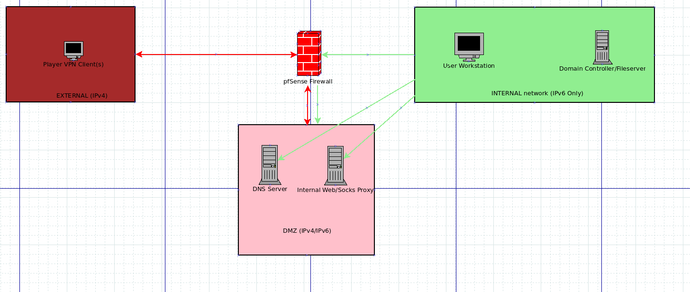

# CySCA 2015 Corporate Penetration Testing Component

## Info
This repository should be used to track work done on the corp penetration testing component for CySCA2015.

## Systems Needed
* DMZ
    * DNS Server (For zone transfer and final exploit challenge)
    * Proxy Server
* Internal
    * User Workstation
    * Windows Server DC

## Designed Solution
1. Perform DNS transfer to list all hosts. Get flag and exposed hostlist (Contains proxy server hostname) 
2. Misconfigured Open proxy (found via nmap) allows players to connect into internal hosts in the DMZ. They gain access to an internal interface page. (1 flag) *BREADCRUMB: Host public page leaks internal ips*
3. Use open proxy to gain access to a restricted shell. Restricted shell has command injection. Use it to gain root level access on the proxy. 
4. Use root access on proxy to MITM http and exploit a vulnerable version of flash update to get desktop access. Flag.
5. Find the SUUSService on the workstation that doesn't securely validate updates. Basic C# RE to determine update packaging algorithm. Trigger update with either command line tool or GUI tool. MITM update request to get execution as SYSTEM. Flag.
6. In another users profile, user has password strength audit. They say they have recovered almost all passwords, so they have been changed. Hash dump supplied included in appendix in report. Users can use krbtgt hash with Golden Ticket to create Domain Admin ticket and gain access to C$ on the DC. Flag.
7. Players use information gleaned from access to a restricted file share to gain user level access to the DNS server and they privilege escalate on the DNS server to capture a flag.

## Diagram

