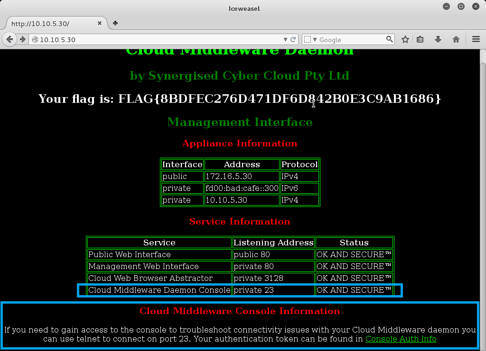
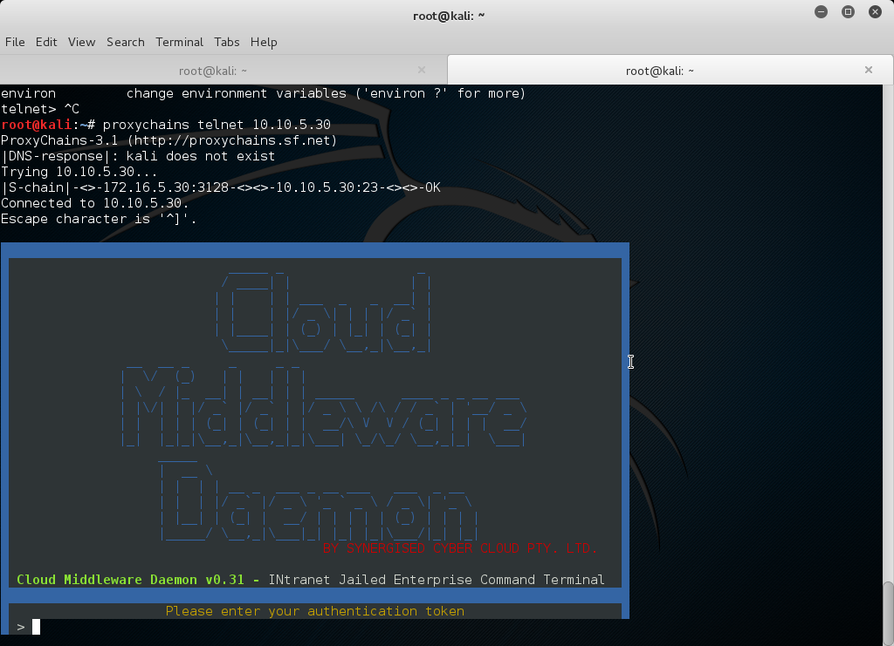
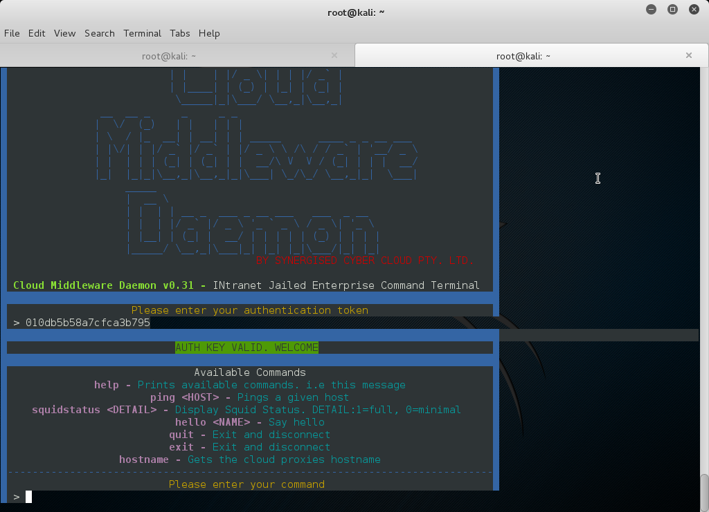
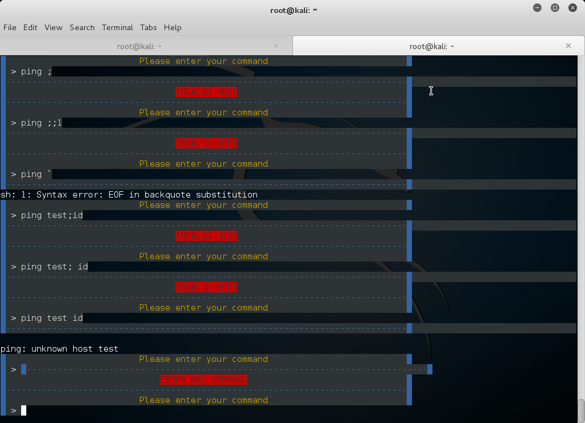
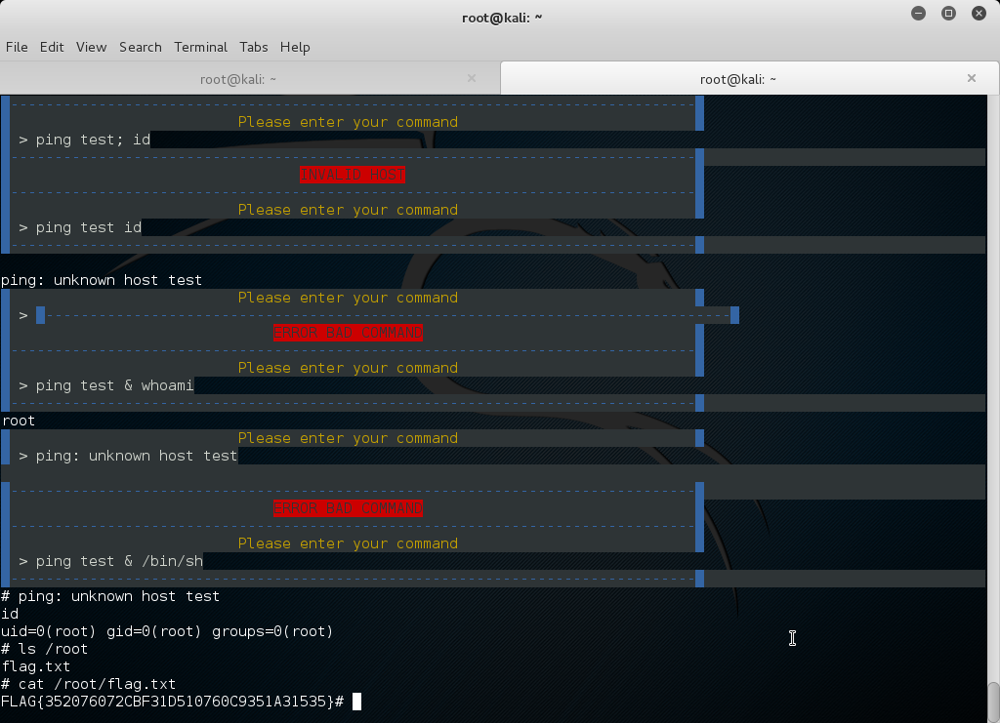

Murphy's Law Writeup
===================
## Category
Corporate Penetration Testing

## Question
Assess the proxy and determine whether you can gain root access.

## Designed Solution
Players needed to connect via the open proxy to the cloud middleware console listening internally on port 23. Once they had done this, they needed to experiment with the commands and determine there is a command injection in the ping command. Players then would use this command injection to gain access to the system as root.

## Hints Given
* Maybe try ping "and"

## Player Solution Comments
Most teams used the ampersand based injection to solve this challenge. A number of teams used other types of command injection characters such as backtick, pipes or dollars. A surprising amount of teams used telnet to connect to proxy.ecwi.cysca:3128 and manually performed the CONNECT request rather than using proxychains.

## Writeup
We start this challenge by looking for any new functionality that is exposed that may give us root access. We notice on the Management page there is a Cloud Middleware Demon Console listening on port 23 on the private interface. It also provides us with instructions saying we can use telnet to connect to port 23 and supplies a link to the Console Auth Info.

Squid supports direct connections to non-standard ports. The appliance creator mis-configured Squid to act as an open proxy, perhaps they also allowed all ports to be directly connected?
We test this by adding the proxy to `/etc/proxychains.conf`. This is done by appending the line `http 172.16.5.30 3128` to end of the file and commenting out the other proxies.

We then run `proxychains telnet 10.10.5.30` to use proxychains to launch telnet and connect to 10.10.5.30. This works, and we are prompted to enter our authentication token.

We retrieve the authentication token from the management console page `http://10.10.5.30/console_auth_info.txt` and enter it to the console. We are provided a list of available commands. At this time we also note the unusual capitalisation of **Cloud Middleware Daemon v0.31 - INtranet Jailed Enterprise Command Terminal** which if all taken spell out **CMD INJECT**.

We proceed to exercise the commands to determine if any are injectable. We note that `ping` and `squidstatus` drop the coloured formatting when returning their responses. We then try supplying `;`'s `&`'s and `` `'s and see no unusual responses from commands `help`, `hello`, `quit`, `exit` or `hostname`.

When we insert these into `squidstatus` we are told invalid detail.

When we insert `` ` into ping we get a sh error. It is `sh: 1: Syntax error: EOF in backquote substitution`. This makes it look as if our input is being interpreted by sh. This may provide an opportunity for command injection.

We try inserting a simple command injection string `ping test; id` but are told INVALID HOST. We then try `ping test id` and after a while it returns `ping: unknown host test`. We take a guess here that semi-colons are being filtered because when we add them to our command we get INVALID HOST. We then try other injection characters and find that we are able to inject `&` characters.

We run the command `ping test & whoami` and immediately get the string `root` in response. After a small wait we get the response `ping: unknown host test`. This confirms that the injection is working, and the console is running as root. From playing with the ping command we can now see that ping was able to run and we were able to pass Ctrl-C, so its likely there is some form of interactive console.

We try the command `ping test & /bin/sh` and get a nice `#` prompt. We run `id` to confirm that we are actually the root user. We then `cat /root/flag.txt` to get our next flag.

