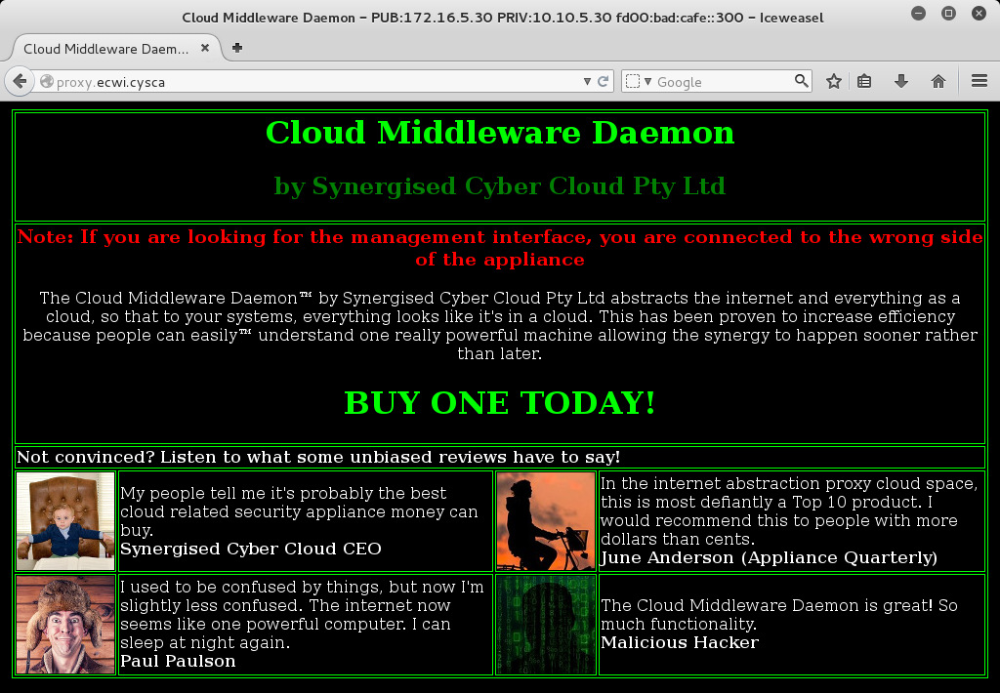
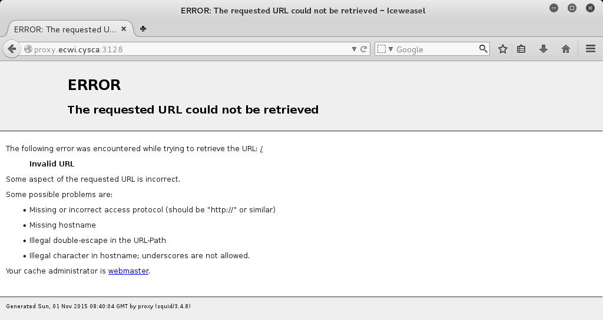
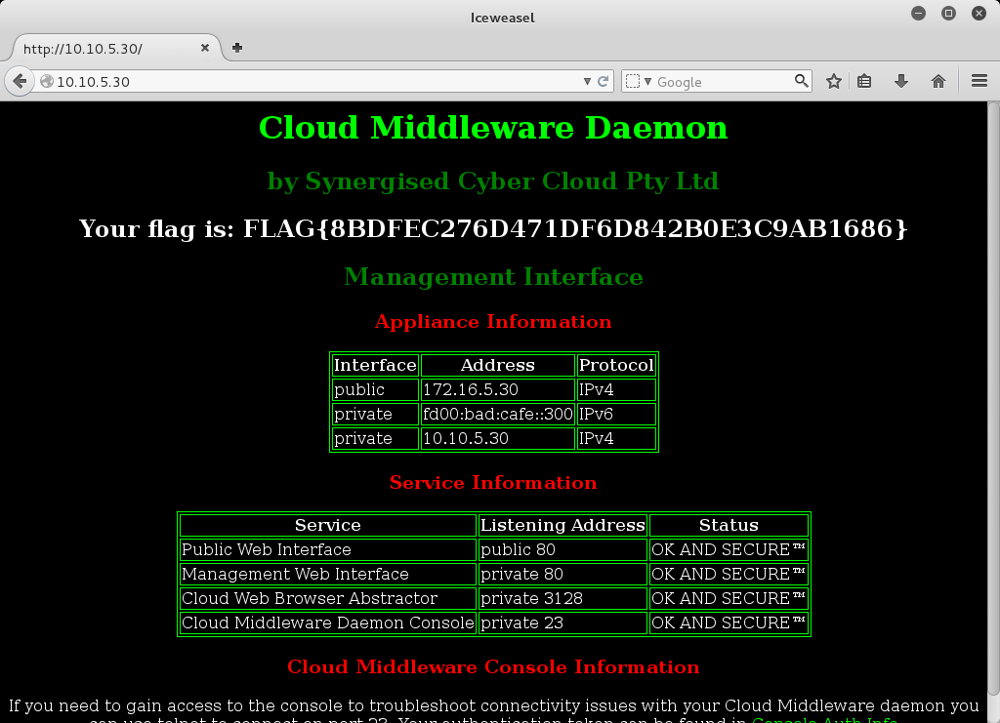

Sales Pitch Writeup
===================
## Category
Corporate Penetration Testing

## Question
Assess the proxy server and try to gain access to the initiative's proxy's management interface.

## Designed Solution
Player's run nmap against the proxy server (address obtained from the previous question). They find a web page trying to sell them an appliance and an open proxy. The public web page tells them they are on the wrong side for the management interface and gives players the internal IP addresses. Players determine that squid acts as an open proxy and they use the proxy to access the management interface.

## Hints Given
None

## Player Solution Comments
Players all solved this in the designed way. As usual there was a little deviation in tools used. Honorable mention to the one team that used `telnet` to manually request the internal page from the squid proxy :)

## Writeup
To start assessing the proxy server we run `nmap` against `proxy.ecwi.cysca` to determine what services are currently listening.

```
root@kali:~# nmap proxy.ecwi.cysca

Starting Nmap 6.49BETA4 ( https://nmap.org ) at 2015-11-01 19:26 AEDT
Nmap scan report for proxy.ecwi.cysca (172.16.5.30)
Host is up (0.00031s latency).
Not shown: 998 closed ports
PORT     STATE SERVICE
80/tcp   open  http
3128/tcp open  squid-http

Nmap done: 1 IP address (1 host up) scanned in 1.67 seconds
```

We see from this basic scan that ports `80` (http) and `3128` (squid) are open. We try browse to `proxy.ecwi.cysca:80` to see what is there.



The public page has a bright red note saying **'If you are looking for the management interface, you are connected to the wrong side of the appliance'**. We can also see in the Webpage title some IP addresses, namely `PUB:172.16.5.30 PRIV: 10.10.5.30` and `fd00:bad:cafe::300`. This probably means that the management interface we want to access is listening on the PRIV IPs.

We then browse to port `proxy.ecwi.cysca:3128` in the browser and we are greeted with a squid error stating `Invalid URL`. We found this interesting as we did not receive an access denied message which we would expect to see.



With the hint talking about being on the wrong side of the appliance and the unusual response from a squid server, we thought we would check to see if the squid server was mis-configured. We set Iceweasel to use `proxy.ecwi.cysca` as our HTTP proxy and tried `proxy.ecwi.cysca` again.

This worked, so we tried browsing to `10.10.5.30` and we were greeted with the management interface and the flag. We also tried connecting to ``[fd00:bad:cafe::300]`` and received the same management interface.


