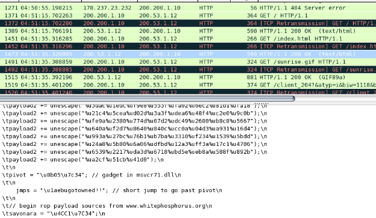
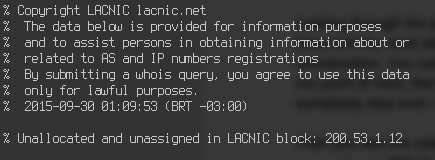
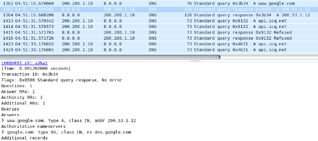
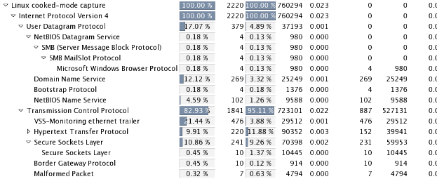
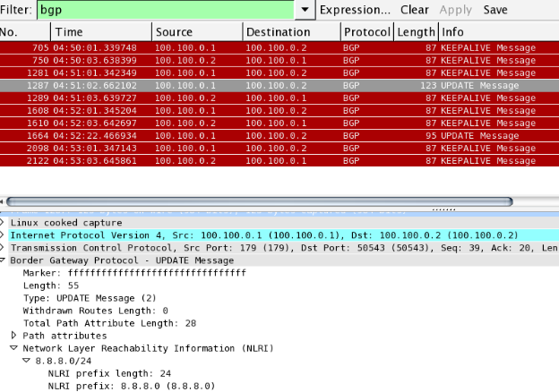
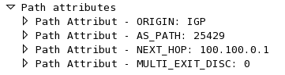
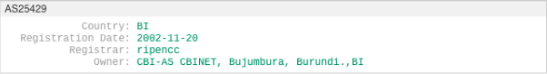

Across Borders Writeup
===================
## Category
Forensics

## Question
Identify the attackers country of origin in the network pcap. The attackers are very sneaky, if you think it's Mexico you may want to check WHOIS. Submit the country name as your answer.

## Designed Solution
Analyse the pcap file. Identify the ICQ conversation pointing the attacker to google.com. Identify the fake IP after the name resolution of google.com. Realise the IP is in an unallocated IP block. Locate the BGP protocol advertising the IP range. Identify the assigned owner of the AS listed as the BGP Path.

## Hints Given
* The answer is not Russia nor anywhere in Latin American and the Carribbean. The malware was served from an IP address which is currently unallocated. How can that be?
* Check any routing protocols in the network capture.

## Player Solution Comments
There were a lot of incorrect results here. People had assorted reasons for these answers, generally related to conclusions drawn from the immediate data rather than following the exploit packet routing through the network.

## Writeup
Looking through the pcap file, we will notice that there are several streams going on. One of them and the most obvious (it’s the first one you’ll see going sequentially) is an ICQ conversation. You can have a look at it and read the conversation, but it’s not interesting from our point of view, there is no attack there. It actually just set’s up the attack. Somebody asks somebody else over ICQ to go just go to google.com.

Then you see the connection to google.com. First there is a DNS query to 8.8.8.8 and then connection to 200.53.1.12. If you are somewhat familiar with google, you’ll notice that it’s not google’s IP. If you look at the source code of the page served by google, you’ll notice that there is an exploit there.

So far so good. Where did the attack come from then? Running a whois query on the IP 200.53.1.12 we’ll see that the IP is unallocated, therefore we can’t infer anything from it, we’ll have to look for more information.

That is very suspicious. Backtracking through the pcap we can see that the 8.8.8.8 server served this address. Very suspicious indeed. We can’t trust the IP addresses!

What else is in the pcap? We can use the protocol summary of Wireshark.

We notice the Border Gateway Protocol. That could be definitely responsible for the shifts in IP addresses. Filtering for BGP we notice that the server 100.100.1.1 announced the 8.8.8.0/24 prefix!

The IP 100.100.0.1 is unallocated according to whois, but we can see the AS number in the PATH attributes.

The AS corresponding to that number is in `Burundi`, which is the answer.

