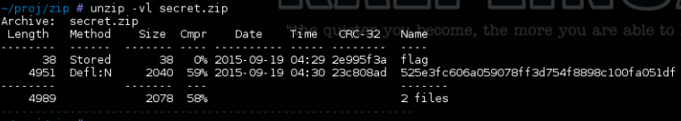
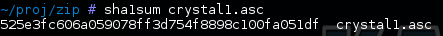
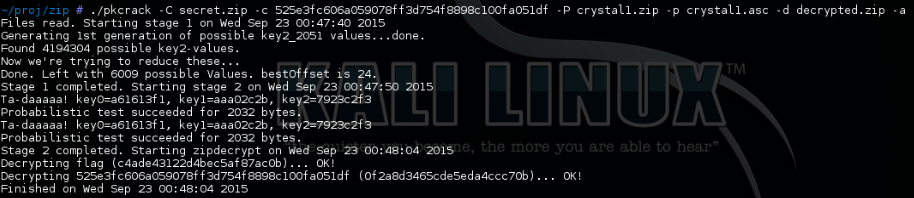

Can't Smoke This Writeup
===================
## Category
Forensics

## Question
Using the Disk/Memory Image. What is John hiding?

## Designed Solution
Look in john's home directory. See the sha1sum filename in the encrypted zip file. Identify the sha1sum file in john's directory. Use pkcrack and the plaintext sha1summed file to extract the contents of the zip file.

## Hints Given
* Check the home directories

## Player Solution Comments
Generally teams solved this challenge by the designed solution. There was some cases where teams solved this challenge by hunting down the original fragments of the flag file before zipping. These were awarded points as this was a more involved process than the designed solution.

## Writeup
What is John hiding? Using the disk image, we look into the home directory of the user john.delgado. We see a secret.zip file clearly. What is he hiding? Listing the contents of the file, we see that it is password protected.

There are two files, one that looks like the flag and one that looks like a SHA1 checksum. We need to remove the password protection somehow. Knowing that this is a zip file, we can execute the known plaintext attack.

We just have to know a file that is inside the password protected zip file. Fortunately there is one, with the name being a SHA1 sum. Maybe there is a file with this hash somewhere nearby. There is a directory called text in john’s home directory. Calculating sha1sums over all files in the directory and its subdirectories, we find one file that is matching.

Then we can just use the tool pkcrack to remove the password and unzip the flag file.

