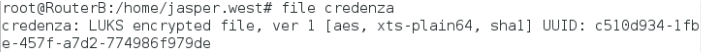
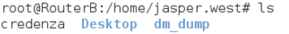
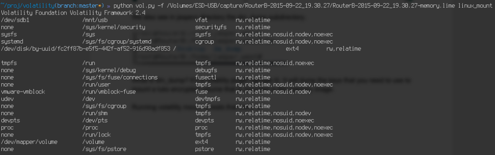
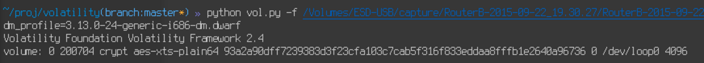

Castaway Writeup
===================
## Category
Forensics

## Question
Using the Disk/Memory Image. Jasper's got a brand new credenza. What did he store?

## Designed Solution
Identify that Jasper's credenza file is an LUKS encrypted file. Identify the dm_dump folder is related to the Volatility plugin. Use the dm_dump with the supplied memory image and volatility profile to recover the LUKS encryption key. Extract the flag from the LUKS volume.

## Hints Given
* Check the home directories

## Player Solution Comments
Teams generally solved this challenge in the designed way. One team manually searched through the memory fragments for the flag before being added to the LUKS.

## Writeup
Looking into jaspers home directory we can see the credenza file. Running the file command over it, it appears to be a LUKS encrypted volume.



We also see in jaspers directory the dm_dump subdirectory.



What is dm_dump? It’s a volatility plugin. It will dump the keys that you need to use to mount a LUKS encrypted volume that is mounted in the memory image.

Running volatility mount reveals that there is nothing suspicious, apart from a mountpoint called volume.



But not to worry, we can just run dm_dump (it’s this easy) and dump the keys. The only problem is that dm_dump expects a profile. Fortunately jasper built the profile in his home directory.



Using this information we can just mount the credenza file using these commands

```
losetup /dev/loop0 credenza
dmsetup create volume --table “OUTPUT FROM DM_DUMP”
mount /dev/mapper/volume /volume
cat /volume/flag
```
