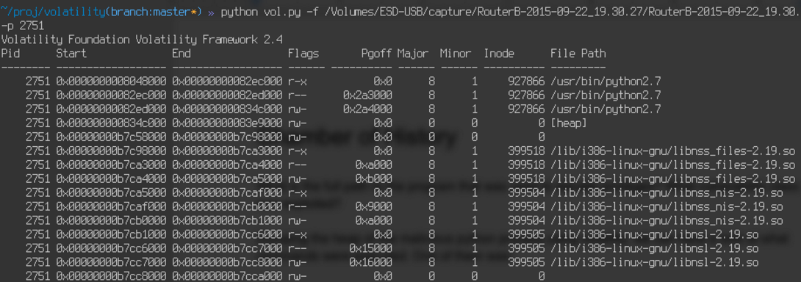

Chamber of History Writeup
===================
## Category
Forensics

## Question
Using the Disk/Memory Image. Indicate the full path to the program that was used to elevate privileges. What vulnerability class was exploited by the attacker? Submit the full path and vulnerability class with no spaces as your answer. I.e. /xxx/xx/xx/xx useafterfree

## Designed Solution
Players dump the heap memory of the suspicious python program. They look at the strings output for the heap memory to determine the commands that were executed. From here they identify that /bin/echo was used to exploit a buffer overflow.

## Hints Given
None

## Player Solution Comments
No teams solved this challenge 100% correctly.

## Writeup
We dump the heap of the malicious python process using volatility,  so that we can have a look at what commands were executed.



Looking through the output with strings we can find the following entry.
```
/bin/echo " + b64decode("kJCQkJCQkJCQkJCQkJCQkJCQkJCQkJCQkJCQkJCQkJAxwFBoLy9zaGgvYmluieNQU4nhsAvNgJCQkJCQkJCQkJCQkJCQkJCQkJCQkJCQkJCQkJCQkJCQkJCQkJCQkJCQkJCQkJCQkJCQkJCQkJCQkJCQkJCQkJCQkJCQkJCQkJBCQkJCQ0NDQ0RERETh9f+/"))
```

We can see that the attacker utilised /bin/echo. You can also find this via checking the home directory of root, where he compiled echo.

If you decode the payload, you’ll see some shellcode plus some garbage and a return address.

So the path is /bin/echo. What vulnerability class was exploited? You can reverse /bin/echo or read the source code to understand that it was buffer overflow.

So the answer is

``/bin/echo` `buffer overflow`
