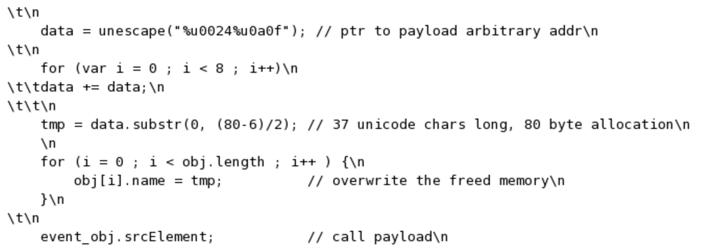

First Shots Writeup
===================
## Category
Forensics

## Question
Identify the CVE exploited by the attacker in the network pcap. Submit the CVE in full CVE format as your answer. I.e CVE-XXXX-XXXX

## Designed Solution
Players identify the exploit payload in `Wireshark`. They then lookup the `srcElement` trigger in Google and get the related CVE.

## Hints Given
* The exploit is triggering a browser vulnerability. This is a good way to start identifying the CVE.

## Player Solution Comments
Teams submitted a varied number of answers to this question. Only five got the answer correct. Most of these seem to have stemmed from misidentification of which part of the payload is the actual vulnerability and which is bypassing mitigations (i.e the heap spray and the Sayonara ROP chain). Sayonara is a relatively universal ROP chain used to bypass Data Execution Prevention (DEP) and Address Space Layout Randomization (ASLR), it uses gadgets from msvcr71.dll and is used in many exploits. Players seem to have searched for Sayonara and msvcr71.dll and then submitted one of the various CVE's with exploits that contain the Sayonara ROP chain.

## Writeup
Once we’ve located the exploit that was transferred, we analyze it a little bit.

It is written in javascript. We see the payload on the trigger clearly. We see that the `srcElement` attribute is the trigger used to call the payload. If you Google for ‘srcElement vulnerability’ the `CVE-2010-0249` immediately comes up.

