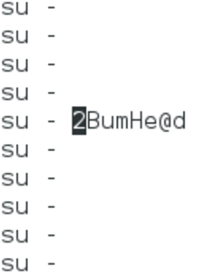

Good One Writeup
===================
## Category
Forensics

## Question
Using the Disk/Memory Image. What is the root password of the box. Submit the password as your answer.

## Designed Solution
Players search the folders for admin users.  Players find the admin.jerama folder and find that in the .bash_history Jeremy has accidentally leaked the root password when using `su`. Players can verify this password against the /etc/shadow file.

## Hints Given
None

## Player Solution Comments
All teams that submitted answers followed the designed solution. All teams that submitted answers were correct.

## Writeup
What is the root password for the box?

One approach is to crack the hash from /etc/shadow. But we will try save some time, if you go through the bash_history of the people on the box, you’ll notice that admin.jerama uses su a lot. Once he made a mistake and typed his password without hitting enter. Hey, happened to me before :)

We can see the password is `2BumHe@d`.
