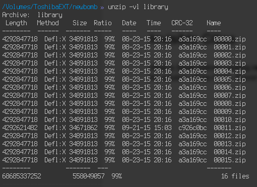
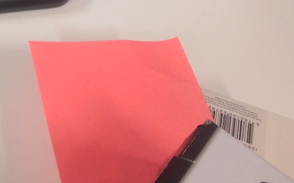
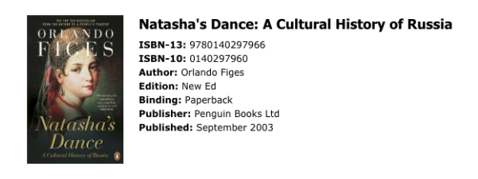

Invisible Cities Writeup
===================
## Category
Forensics

## Question
Using the Disk/Memory Image. What book did Sarah read? Submit the book name as your answer.

## Designed Solution
Players identify the zip file in Sarah's home folder. They identify the file of interest as it has different checksum. After multiple extractions of zip files. Players get an image, it contains a partial ISBN code. Players can generate the missing number and identify the book as `Natasha's Dance`.

## Hints Given
* Check the home directories.

## Player Solution Comments
Players generally followed the designed solution for this one. One team instead of computing the check digit just searched the Internet for all combinations of the check digit from 0-9.

## Writeup
What is Sarah hiding? Looking into Sarah’s directory, we can see the file called library.

Clearly the solution will be inside. Running the file command over it, we see that it contains a whole bunch of very large 4GB files with the same checksum. One checksum is different though. Trying to extract all the files will take a long time and also a lot of disk space. So we have to extract one by one, descending down the file.

At each step you’ll have to remove the whitespace at the end of the zipfile, otherwise zip will complain.

Once you get to the bottom (5 levels) you’ll see a jpeg image.

There is a book in there, but it only shows the ISBN number. Also the last number of the ISBN is covered. Thankfully we know that ISBN is error correcting and the last digit is computed based on the preceding digits. Therefore we can compute it. The ISBN without the last digit is

`978014029796`

Computing the last digit we get 6.

The whole ISBN is `9780140297966`

Searching Google for the ISBN we get `Natasha’s Dance`.

