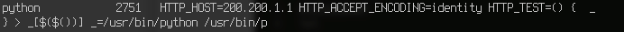

Samba for Two Writeup
===================
## Category
Forensics

## Question
Using the Disk/Memory Image. What was the CVE used in the attack. Submit the CVE in full CVE format as your answer. I.e CVE-XXXX-XXXX

## Designed Solution
Players look at how the malicious process was spawned. They analyse the environment variables and see that it used the CVE-2014-6278 class of shellshock.

## Hints Given
None

## Player Solution Comments
Most teams realised that this was an instance of shellshock. Some got partial points for submitting similar shellshock CVEs that were not this exact one.

## Writeup
Once we’ve identified the malicious process, we can start looking for how it was spawned in the first place. Since it was spawned through bash, we get a hint that it might have something to do with shellshock. Looking at the environment variables associated with the process 2751 we can clearly see that shellshock happened.

There are several shellshock CVEs, but the correct one is `CVE-2014-6278`.
