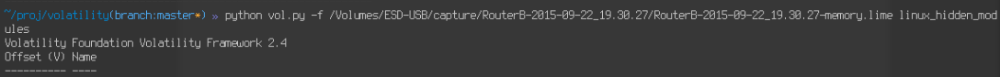
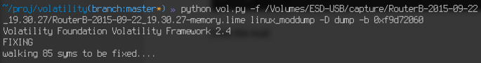
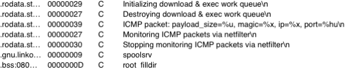
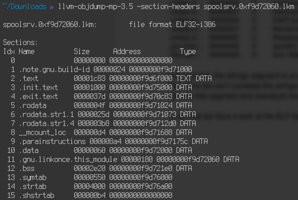
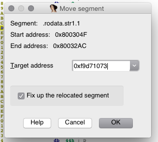
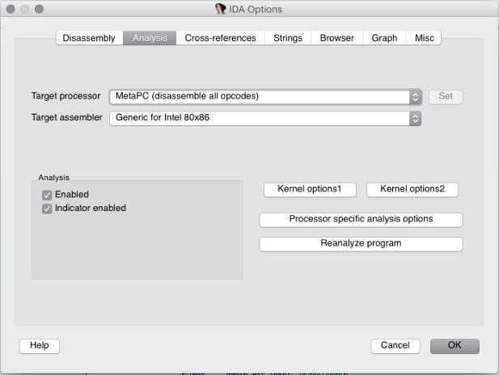
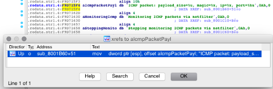
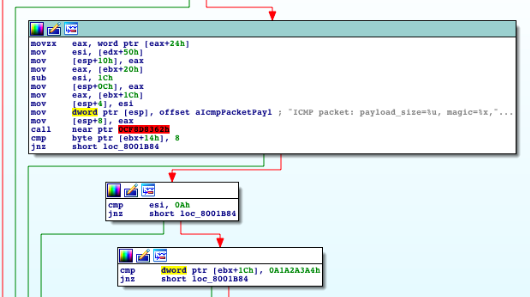

Slaptas Kanalas Writeup
===================
## Category
Forensics

## Question
Slaptas Kanalas - Using the Disk/Memory image. The attacker deployed additional means of persistence on the machine. Indicate the channel (protocol) that allows them to open a control connection remotely and the key value that will unlock this channel. Submit the protocol and hex encoded bytes (without a leading 0x) as your answer. I.e udp aabbccddeeff00

## Designed Solution
Players identify the hidden kernel module. They dump a copy of the module for analysis. Players need to adjust the segment containing the strings to the correct memory address. They identify the ICMP and the key comparison in the disassembly.

## Hints Given
None

## Player Solution Comments
No teams solved this 100% correctly. One team partially solved it by identifying that the backdoor used ICMP however they had an incorrect key value.

## Writeup
The attacker deployed additional means of persistence on the machine. Indicate the channel (protocol) that allows them to open a control connection remotely and the key value that will unlock this channel.

This one requires a bit of hunting. Using the linux_hidden_modules plugin we can see there is a hidden module - it does not show in the normal module listing (linux_lsmod). We can dump the whole module and analyze it to find the answers using linux_moddump.

Once the module has been dumped, we load it in IDA.

Using the Strings window, we can see that the channel is ICMP requests.

Unfortunately the strings segment is at a different address than that indicated by the ELF headers. Therefore we can’t correlate the strings in IDA and can’t see where the strings are used. We have to relocate the segment and reanalyze the program.

To do that we have a look at the ELF headers, using objdump.

The rodata.str1.1 has to be at 0xf9d71073 for example.

We can relocate it via IDA.
 Edit -> Segments -> Move current segment

We now have correct string addresses. We just have to reanalyze the program to match the strings back to code that is using them. We do that through Options->General -> Reanalyze Program

After that we can user crossreferences to determine where the strings are used.

We can see the parameters being pushed in the stack before a function is being called. We can guess this is going to be a printf function (in the kernel it’s printk).

The second parameter to the format string is at ebx+1Ch, which is the magic value. Two basic blocks below, we can see that this value is being compared to 0xa1a2a3a4. Therefore the key being used is 0xa1a2a3a4.

The answer is then :
`ICMP` `0xa1a2a3a4`
