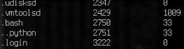
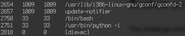

Snakes On The Plane Writeup
===================
## Category
Forensics

## Question
Using the Disk/Memory Image. What is the PID of the malicious process. Submit the PID as your answer.

## Designed Solution
Players analyse the process listing and identify the suspicious python session running as the www-data user.

## Hints Given
* You should be able to find a working profile on the internet.

## Player Solution Comments
Many teams got this correct. Some teams identified system processes as suspicious and submitted their PIDs.

## Writeup
This challenge involves basically just looking through process listings in volatility plugins linux_pstree, linux_psaux and linux_pslist. You will notice that there is bash and interactive python spawned by the user www-data (UID 33), which is clearly wrong. The PID of the interactive python spawned by apache is 2751.

